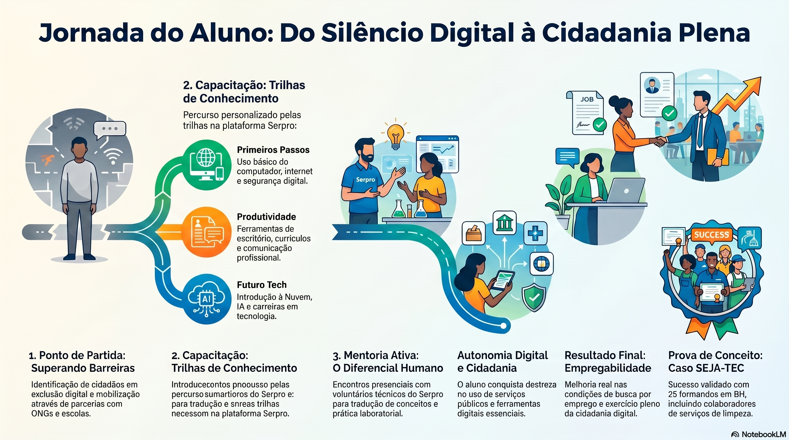

# Programa contínuo de mentoria em cidadania digital e tecnologia aplicada para inclusão social e melhoria de empregabilidade

**Tema:** Tema 2 - Transformação Digital para Clientes e Cidadãos

**Assunto:** Inclusão e Letramento Digital

**Extensão estimada:** 12 a 30 páginas, conforme regulamento

**Observação:** esta versão é a base detalhada de desenvolvimento; a versão anônima de submissão deve remover identificação de autoria e qualquer dado que possa expor o autor.

## Folha de rosto

**Título do trabalho:** Programa contínuo de mentoria em cidadania digital e tecnologia aplicada para inclusão social e melhoria de empregabilidade.

**Tema:** Tema 2 - Transformação Digital para Clientes e Cidadãos.

**Assunto:** Inclusão e Letramento Digital.

**Autor:** [NOME RESTRITO PARA AVALIAÇÃO ANÔNIMA]

**Minicurrículo:** [CURRÍCULO RESTRITO PARA AVALIAÇÃO ANÔNIMA]

## Resumo

Este trabalho propõe a estruturação de um modelo de mentoria contínua em cidadania digital, desenhado como uma startup educacional interna no Serpro, com apoio em ativos institucionais já existentes. A iniciativa busca reduzir barreiras de acesso, uso e apropriação crítica de serviços digitais por jovens e adultos em situação de vulnerabilidade, colaboradores terceirizados e públicos de comunidades parceiras.

Ao combinar trilhas de aprendizado, mediação presencial e voluntariado técnico, a proposta amplia a autonomia do cidadão, fortalece a empregabilidade e gera desenvolvimento de competências socioemocionais nos mentores. O modelo é replicável, aderente à agenda ESG e alinhado ao Key Result Expected (KRE) de inclusão digital do Serpro, em consonância com a lógica de tecnologia social e acompanhamento personalizado defendida por iniciativas de inclusão ativa e produtiva.

**Palavras-chave:** inclusão e letramento digital; cidadania digital; tecnologia social; mentoria; empregabilidade; vulnerabilidade; transformação digital; voluntariado técnico; impacto social.

## Sumário preliminar

1. Introdução
2. Justificativa e alinhamento estratégico
3. Desenvolvimento do modelo proposto
4. Público-alvo e impacto social
5. Prova de conceito e viabilidade técnica
6. Roadmap de implantação
7. Indicadores de acompanhamento
8. Conclusões e resultados esperados
9. Referências
10. Controle de submissão (anônima e identificada)

## 1. Introdução

A transformação digital do Estado brasileiro ampliou a oferta de serviços públicos, mas também evidenciou um paradoxo social: a existência de cidadãos que permanecem excluídos por barreiras de acesso, letramento e confiança no uso da tecnologia. Esse cenário afeta tanto a fruição da cidadania quanto a inserção produtiva no mercado de trabalho.

Nesse contexto, a proposta parte da premissa de que inclusão digital não se limita ao fornecimento de acesso à internet ou à disponibilização de conteúdos autoinstrucionais. Em muitos casos, o principal gargalo está na mediação humana, na tradução pedagógica dos conteúdos e no acompanhamento do processo de aprendizagem. Experiências recentes do próprio Serpro, como o SEJA-TEC em Belo Horizonte, demonstram que a combinação entre tecnologia, mediação e apoio institucional pode gerar resultados concretos em percursos educacionais de jovens e adultos (SERPRO, 2025).

O objetivo deste trabalho é propor um programa contínuo de mentoria em cidadania digital, estruturado sobre três eixos: trilhas de aprendizado, mentoria ativa e replicabilidade institucional. A solução dialoga com a plataforma Serpro Cidadão Digital e com a infraestrutura física das regionais, convertendo ativos subutilizados em um ecossistema de impacto social. Em termos metodológicos, a proposta se ancora na ideia de tecnologia social com acompanhamento personalizado, coerente com práticas de inclusão produtiva já sistematizadas por organizações especializadas (ITS BRASIL, 2024). __avaliar se adicionamos mais referências ou apenas citamos "...como as melhores práticas do mercado" (revisar)__

## 2. Justificativa e alinhamento estratégico

### 2.1. Conexão com a agenda ESG

O programa contribui diretamente para o pilar Social da agenda ESG ao atuar sobre três frentes, em linha com os planos interno e externo de responsabilidade social recentemente institucionalizados pelo Serpro (SERPRO, 2026):

- Redução de desigualdades por meio da inclusão de públicos historicamente vulnerabilizados.
- Promoção de uso seguro e responsável da tecnologia, com atenção à privacidade, à segurança da informação e à LGPD.
- Uso mais eficiente de recursos institucionais já existentes, sem depender de expansão estrutural relevante.

### 2.2. Alinhamento com o KRE e o planejamento estratégico

O planejamento estratégico do Serpro prevê metas relacionadas à inclusão digital. A proposta fortalece esse indicador ao substituir ações pontuais por uma lógica de continuidade, acompanhamento e resultado observável. Em vez de contabilizar apenas eventos, passa-se a medir evolução de competências, taxa de conclusão, satisfação dos participantes e potencial de replicação.

A aderência regulatória também é reforçada pelo diálogo com a Lei Geral de Proteção de Dados, uma vez que o trabalho não apenas ensina o uso de ferramentas, mas também promove comportamentos digitais mais seguros e responsáveis (BRASIL, 2018).

### 2.3. Avaliar a Convergência com o Projeto 914BRZ5067 (Anatel/UNESCO) e se colocamos aqui na proposta (revisar)

Esta proposta apresenta convergência direta com o Projeto 914BRZ5067, cooperação técnica internacional firmada em 2024 entre Anatel e UNESCO, que vem estruturando frentes de conectividade significativa, inserção digital e suporte à governança tecnológica (ANATEL, 2025a; ANATEL, 2025b).

No plano prático, o programa de mentoria funciona como vetor de execução territorial para diretrizes de competências digitais e segurança online, com foco em públicos vulneráveis. Aderem especialmente ao projeto as seguintes frentes de oportunidade:

- **Chamadas e mapeamentos de práticas:** alta aderência para posicionamento institucional e formação de portfólio público de boas práticas.
- **Sinergia com facilitadores regionais:** alta aderência para uso das trilhas e metodologia em eventos, oficinas e ações locais.
- **Visibilidade e novas parcerias:** alta aderência para apresentação do caso SEJA-TEC e da estratégia de escala em fóruns técnicos.

Para fins de governança e credibilidade perante a banca, esta convergência deve ser tratada como oportunidade potencial condicionada a editais, critérios de seleção e disponibilidade de chamadas públicas, e não como fonte de recurso garantida.

**Ganhos esperados por dimensão:**

- **Social:** autonomia do cidadão, ampliação de acesso a serviços digitais e melhoria da empregabilidade.
- **Organizacional:** desenvolvimento de comunicação didática, empatia, liderança e escuta ativa entre os mentores.
- **Institucional:** fortalecimento da reputação do Serpro como agente de transformação e produtor de valor público.

## 3. Desenvolvimento do modelo proposto

### 3.1. Fundamentação e lógica de startup educacional

A proposta adota uma lógica de startup educacional porque essa abordagem favorece validação rápida, ciclo de feedback curto e melhoria contínua. O foco não está em criar um curso extenso e rígido, mas em oferecer um modelo mínimo viável, testável e escalável. Esse desenho é compatível com abordagens contemporâneas de formação em tecnologia social, que articulam mediação, acompanhamento e adaptação progressiva ao perfil do público atendido (ITS BRASIL, 2024; SOMAI EDTECH, 2024).

### 3.2. Metodologia do programa

O programa deve operar em ciclos curtos, com grupos pequenos e forte mediação humana:

- **Turmas:** de 10 a 20 participantes, para preservar a qualidade do atendimento.
- **Ciclos:** de 4 a 8 encontros presenciais por mês, com 2 a 3 horas de duração.
- **Ambiente:** laboratórios das regionais, espaços parceiros ou ambientes equivalentes com infraestrutura adequada.
- **Dinâmica pedagógica:** exposição guiada, prática supervisionada, exercícios orientados e fechamento com plano individual de continuidade.

### 3.3. Trilhas de aprendizado

As trilhas devem ser modulares e adaptáveis conforme o perfil do público. A estrutura sugerida está representada no infográfico [Jornada do Aluno](Jornada_do_Aluno_Digital.png), que organiza a experiência em etapas de superação de barreiras, capacitação, mentoria, autonomia e resultado final.

**Figura 1 - Jornada do aluno digital**

#### Trilha 1: Primeiros passos no mundo digital

Foco em alfabetização digital, com conteúdos sobre uso do computador, navegação segura, e-mail, contas digitais e proteção de dados.

Conteúdos obrigatórios de segurança e cidadania digital nesta trilha:

- prevenção a golpes digitais, phishing e engenharia social;
- identificação de desinformação e fake news;
- prevenção ao cyberbullying e violência digital;
- proteção de dados pessoais e direitos do titular previstos na LGPD;
- navegação segura para crianças e adolescentes no contexto familiar.

#### Trilha 2: Produtividade e empregabilidade

Foco em currículos, organização digital, planilhas básicas, comunicação profissional e preparação para rotinas de estudo e trabalho.

#### Trilha 3: Futuro Tech

Foco em noções introdutórias de dados, nuvem, inteligência artificial e carreiras em tecnologia, com linguagem acessível e incentivo à continuidade formativa.

### 3.4. Papel do mentor

O mentor não atua apenas como instrutor, mas como mediador pedagógico e agente de desenvolvimento social. Sua função inclui traduzir conceitos técnicos para linguagem acessível, apoiar a navegação por barreiras práticas e estimular autoconfiança no uso de ferramentas digitais.

Esse papel também gera valor interno para o Serpro, pois desenvolve competências como comunicação clara, empatia, paciência, liderança de grupos e escuta ativa.

## 4. Público-alvo e impacto social

O público do programa pode ser organizado em três camadas:

- **Público externo prioritário:** jovens e adultos da EJA, participantes de comunidades periféricas e outros grupos em vulnerabilidade com baixa proficiência digital.
- **Público interno ampliado:** colaboradores terceirizados e seus familiares, como forma de ampliar o impacto social dentro da própria instituição.
- **Agentes transformadores:** empregados do Serpro que atuam como voluntários e ampliam sua formação em liderança, didática e relacionamento humano.

Essa segmentação é importante porque permite calibrar linguagem, carga de conteúdo e formato de acompanhamento conforme o perfil do participante. Além disso, ela está alinhada com a compreensão de que a inclusão produtiva deve ser pensada a partir da pessoa, das barreiras contextuais e do suporte continuado, e não apenas da oferta formal de conteúdo (ITS BRASIL, 2024).

## 5. Prova de conceito e viabilidade técnica

A proposta ganha consistência ao se apoiar na experiência SEJA-TEC, citada como prova de conceito na regional Belo Horizonte. Segundo a comunicação institucional do Serpro, o ciclo formativo reuniu 25 formandos (8 da turma SEJA-TEC e 17 de turmas parceiras da EJA), incluindo trabalhadores terceirizados, articulando alfabetização e inclusão digital em um mesmo percurso (SERPRO, 2025). O caso reforça a viabilidade operacional de trilhas com mediação ativa.

Elementos consolidados para a leitura da PoC:

- **Escala inicial validada:** 25 concluintes em ambiente de parceria educacional local.
- **Perfil aderente ao alvo social:** estudantes da EJA e público trabalhador com histórico de exclusão educacional e digital.
- **Viabilidade financeira:** aproveitamento de infraestrutura existente, conteúdo já disponível e mobilização voluntária técnica.
- **Potencial de replicação:** modelo passível de adaptação para regionais com suporte de governança e indicadores.

## 6. Roadmap de implantação

| Fase | Objetivo | Entregas esperadas |
| --- | --- | --- |
| Mês 1 | Planejamento e estruturação | Definição da governança, seleção de mentores, revisão das trilhas e mapeamento de parceiros locais. |
| Mês 2 | Execução do piloto | Início das turmas, aplicação da metodologia e coleta de feedback com mentores e participantes. |
| Mês 3 | Mensuração e escala | Análise dos resultados, ajustes do modelo e preparação de guia de replicação para outras regionais. |

### 6.1. Estratégia de alcance externo e financiamento complementar

Para ampliar alcance e sustentabilidade, recomenda-se executar um plano de articulação externa em paralelo ao piloto:

- inscrever o programa em chamadas e mapeamentos aderentes à agenda de competências digitais;
- preparar portfólio técnico de submissão com metodologia, indicadores e evidências da PoC;
- posicionar as trilhas como conteúdo de referência para facilitadores regionais em eventos e oficinas;
- estruturar narrativa de escala (SEJA-TEC para modelo multirregional) para painéis técnicos e fóruns de conectividade;
- manter trilha documental de resultados para captação de apoios institucionais não orçamentários.

Premissas de prudência para captação externa:

- tratar toda oportunidade como condicionada a edital e processo seletivo público;
- evitar, no planejamento financeiro interno, dependência de recursos externos ainda não contratados;
- manter plano de execução autossuficiente com ativos internos, usando parcerias como alavanca de escala e visibilidade.

## 7. Indicadores de acompanhamento

Para que a proposta tenha aderência ao regulamento e gere evidência de impacto, é importante definir indicadores objetivos:

- taxa de conclusão das turmas;
- presença e permanência ao longo do ciclo;
- satisfação dos participantes;
- evolução percebida de autonomia digital;
- horas de voluntariado mobilizadas;
- número de replicações ou novas turmas;
- contribuição para o KRE de inclusão digital.

Indicadores recomendados para conexão com ESG e ODS:

- **ODS 4 (Educação de Qualidade):** percentual de participantes com progressão de proficiência digital entre diagnóstico inicial e avaliação final.
- **ODS 10 (Redução das Desigualdades):** percentual de concluintes pertencentes a grupos prioritários (EJA, baixa renda, terceirizados e familiares).
- **Segurança digital cidadã:** percentual de participantes que demonstram práticas de prevenção a fraudes e proteção de dados após o ciclo formativo.

Esses indicadores permitem associar esforço formativo e resultado social, tornando a execução comparável entre turmas, regionais e ciclos de mentoria.

## 8. Conclusões e resultados esperados

O programa proposto apresenta boa aderência estratégica porque usa ativos já disponíveis, atende a uma necessidade social concreta e gera benefício simultâneo para sociedade e organização. O maior diferencial está na combinação entre tecnologia, mediação humana e continuidade.

Como resultado, espera-se ampliar autonomia dos participantes, fortalecer competências dos mentores e consolidar o Serpro como agente de transformação social com impacto mensurável. Em termos de inovação pública, a proposta é forte porque desloca o foco de iniciativas pontuais para um modelo sustentável, escalável e mais próximo da realidade dos usuários finais. A proposta também dialoga com a Agenda 2030 ao reforçar inclusão, educação e redução de desigualdades como componentes indissociáveis de desenvolvimento sustentável (ORGANIZAÇÃO DAS NAÇÕES UNIDAS, 2015).

No âmbito de articulações externas, a estratégia recomendada combina ambição institucional com prudência executiva: utilizar referências de cooperação internacional como validação técnica e reputacional, preservando a autonomia operacional do programa e a sustentabilidade do plano mesmo na ausência de financiamento externo.

## 9. Referenciais metodológicos, benchmarks e propriedade intelectual

As referências a ITS Brasil, Somai EdTech e outras iniciativas externas são estritamente metodológicas, com função de benchmark técnico-pedagógico. Não há, nesta proposta, compromisso orçamentário, vínculo contratual ou cessão de propriedade intelectual com essas instituições.

A execução, a governança e a propriedade intelectual do programa permanecem centralizadas na expertise técnica interna do Serpro, com eventuais cooperações externas condicionadas a instrumentos formais específicos.

## 10. Referências

ASSOCIAÇÃO BRASILEIRA DE NORMAS TÉCNICAS. ABNT NBR 6023: informação e documentação: referências: elaboração. Rio de Janeiro: ABNT, 2018.

ASSOCIAÇÃO BRASILEIRA DE NORMAS TÉCNICAS. ABNT NBR 10520: informação e documentação: citações em documentos: apresentação. Rio de Janeiro: ABNT, 2023.

BRASIL. Lei n. 13.709, de 14 de agosto de 2018. Lei Geral de Proteção de Dados Pessoais (LGPD). Diário Oficial da União: seção 1, Brasília, DF, 15 ago. 2018.

AGÊNCIA NACIONAL DE TELECOMUNICAÇÕES (ANATEL). Anatel e UNESCO selecionam consultor para projeto de cooperação em Inteligência Artificial (IA). Brasília: Anatel, 2025a. Disponível em: https://www.gov.br/anatel/pt-br/assuntos/noticias/anatel-e-unesco-selecionam-consultores-para-projeto-de-cooperacao-em-inteligencia-artificial-ia. Acesso em: 26 jun. 2026.

AGÊNCIA NACIONAL DE TELECOMUNICAÇÕES (ANATEL). Anatel e UNESCO selecionam consultores/facilitadores para projeto em Conectividade Significativa destinado à inserção digital de idosos. Brasília: Anatel, 2025b. Disponível em: https://www.gov.br/anatel/pt-br/assuntos/noticias/anatel-e-unesco-selecionam-consultores-facilitadores-para-projeto-de-cooperacao-em-conectividade-significativa-sobre-insercao-digital-de-idosos. Acesso em: 26 jun. 2026.

INSTITUTO DE TECNOLOGIA SOCIAL (ITS BRASIL). Metodologia do emprego apoiado. São Paulo: ITS Brasil, 2024. Disponível em: https://itsbrasil.org.br/areas-de-atuacao-metodologia-do-emprego-apoiado/. Acesso em: 26 jun. 2026.

ORGANIZAÇÃO DAS NAÇÕES UNIDAS. Transformando nosso mundo: a Agenda 2030 para o Desenvolvimento Sustentável. Nova York: ONU, 2015. Disponível em: https://brasil.un.org/pt-br/sdgs. Acesso em: 26 jun. 2026.

SERPRO. Plataforma Cidadão Digital. Brasília: Serpro, 2024. Disponível em: https://cidadaodigital.serpro.gov.br/. Acesso em: 26 jun. 2026.

SERPRO. SEJA-TEC: inclusão digital para jovens e adultos. Belo Horizonte: Notícias Serpro, 2025. Disponível em: https://www.serpro.gov.br/menu/noticias/noticias-2025/seja-tec. Acesso em: 26 jun. 2026.

SERPRO. Serpro institucionaliza agenda de responsabilidade social. Brasília: Notícias Serpro, 2026. Disponível em: https://www.serpro.gov.br/menu/noticias/noticias-2026/serpro-institucionaliza-agenda-de-responsabilidade-social. Acesso em: 26 jun. 2026.

SOMAI EDTECH. Pensamento crítico e abordagem pedagógica na educação tecnológica. 2024. Disponível em: https://www.somai.com.br/about.php. Acesso em: 26 jun. 2026.

### Consolidação da redação acadêmica

A versão final adota linguagem analítica, com ênfase em conceitos verificáveis, evitando formulações promocionais ou metafóricas. Essa escolha fortalece a precisão argumentativa e a aderência às normas ABNT de citação e referência (ASSOCIAÇÃO BRASILEIRA DE NORMAS TÉCNICAS, 2023; ASSOCIAÇÃO BRASILEIRA DE NORMAS TÉCNICAS, 2018).

### Controle de submissão (anônima e identificada)

Para conformidade com o regulamento do prêmio, recomenda-se manter duas versões finais do arquivo:

- **Versão anônima:** manter os campos [NOME RESTRITO PARA AVALIAÇÃO ANÔNIMA] e [CURRÍCULO RESTRITO PARA AVALIAÇÃO ANÔNIMA], sem dados que permitam identificação.
- **Versão identificada (original):** substituir os campos restritos por nome completo e minicurrículo definitivo.

Checklist mínimo de conformidade:

- remover nomes, iniciais e autoidentificação no corpo do texto da versão anônima;
- revisar metadados do arquivo antes da submissão;
- confirmar que anexos e figuras não expõem autoria.
